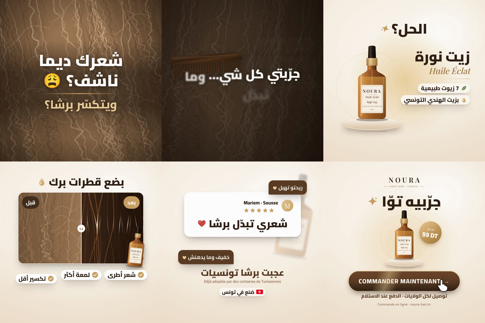

# NOURA · Huile Éclat : pub vidéo Meta de 30 s (1:1, Remotion)

▶️ **Vidéo rendue :** [`renders/noura/noura-huile-eclat-30s-1x1.mp4`](renders/noura/noura-huile-eclat-30s-1x1.mp4) (1080×1080, 30 fps, 900 frames, H.264 + AAC)
🖼️ **Storyboard :** [`renders/noura/storyboard.jpg`](renders/noura/storyboard.jpg) · **Couverture :** [`renders/noura/cover-1x1.jpg`](renders/noura/cover-1x1.jpg)
🧩 **Code :** `src/noura/` · composition Remotion **`NouraAd`**



---

## 1. Concept publicitaire

**Nom de code : « Le peigne qui bloque ».**
Tout le monde a vécu ce moment : le peigne qui se coince dans des cheveux secs et frisottés. On ouvre sur ce moment-là, en macro, avec la question que la cible se pose chaque matin. Ensuite, la lumière « s'allume » et le produit apparaît sur un socle, comme dans une pub de parfum. La transformation se fait par un **avant / après en balayage**, déclenché par une goutte d'huile. Une **preuve locale** suit (avis de cliente, « fabriqué en Tunisie »), puis un écran final qui lève les deux freins principaux du e-commerce tunisien : **livraison dans toutes les wilayas et paiement à la livraison**.

**Produit (inventé pour être crédible) :**

| | |
|---|---|
| Marque | **NOURA** · Hair Care · Tunisie |
| Produit | **Huile Éclat** (زيت نورة) : huile capillaire nourrissante, 50 ml, flacon compte-gouttes en verre ambré |
| Promesse | 7 huiles naturelles, avec comme ingrédient phare l'**huile de pépins de figue de barbarie** (زيت الهندي), un ingrédient tunisien, rare et premium, qui ancre la marque localement |
| Prix | 59 DT (modifiable dans `config.ts`) |
| Positionnement | Simple (quelques gouttes), désirable (rituel beauté), premium (verre ambré, doré, crème) |

Pourquoi la figue de barbarie ? C'est un vrai trésor tunisien qui se vend cher à l'export. Il donne une **raison d'y croire** (reason to believe) et un argument de **fierté locale** qu'une marque d'import ne peut pas copier.

## 2. Profil de la cible

**« Yasmine », 20–45 ans**, Tunis / Sousse / Sfax / Nabeul, étudiante ou active, sur Facebook et Instagram tous les jours.
- **Problème vécu :** cheveux secs, cassants, frisottis (« منفوش »), pas de brillance. Elle a « tout essayé » (masques, kératine, huiles du marché) et finit avec un chignon ou une pince (« تلمّيه بالبنسة »).
- **Désir :** des cheveux doux, brillants, faciles à coiffer, sans passer 2 h dans la salle de bain ni ruiner son budget.
- **Freins :** peur des arnaques en ligne et des faux produits, peur d'un produit qui graisse, prix.
- **Leviers :** recommandation d'autres Tunisiennes, produit local et naturel, paiement à la livraison, livraison partout.
- **Ciblage Meta conseillé :** Femmes 20–45, Tunisie, centres d'intérêt *Soins des cheveux, Beauté, Cosmétiques bio, Huile d'argan, Shopping en ligne* (ou Advantage+ audience avec ces suggestions).

## 3. Script tunisien complet (voix off)

Voix féminine tunisienne, 25–30 ans, ton de créatrice de contenu : chaleureuse, complice, sourire dans la voix, jamais criarde. **67 mots.**

| Début | Scène | Voix off (Derja) | Intention de jeu |
|---|---|---|---|
| 0,15 s | Hook | **شعرك ديما ناشف ويتكسّر؟ إستنّى، هذا ليك.** | Interpellation directe, comme une amie qui t'arrête dans la rue. « إستنّى » = pattern interrupt verbal |
| 3,1 s | Problème | **تمشّطيه يتنفّش، تحطّي كريمات وما يتبدّل شي، وفي الآخر تلمّيه بالبنسة وخلاص.** | Complicité, un peu d'autodérision (« je te comprends ») |
| 8,2 s | Révélation | **تعرّفي على زيت نورة: سبعة زيوت طبيعية، والسرّ متاعو زيت الهندي التونسي، خفيف وما يدهنش.** | Le ton s'éclaire, fierté sur « التونسي » |
| 14,2 s | Bénéfices | **بضع قطرات برك على الأطراف، وشعرك يولّي أطرى، يلمع، ويتكسّر أقل. والنتيجة تحكي وحدها.** | Rythmé, une respiration entre chaque bénéfice |
| 21,2 s | Preuve | **والبنات اللي جرّبوه الكل يقولولك نفس الكلمة: شعري تبدّل برشا!** | « شعري تبدّل برشا » dit comme une citation, avec émotion |
| 26,2 s | CTA | **جرّبيه توّا! التوصيل لكل تونس والخلاص عند الاستلام.** | Énergique et souriant, sans urgence agressive |

Le script est aussi dans `VOICEOVER_SCRIPT` (`src/noura/config.ts`), où il sert à baisser automatiquement la musique pendant la voix.

## 4. Timeline seconde par seconde

| Temps | Scène | Image | Texte écran | Son |
|---|---|---|---|---|
| 00:00 | Hook | Macro cheveux secs en diagonale, **zoom arrière brutal + secousse** dès la frame 0 | « شعرك ديما ناشف؟ 😩 » mot par mot | « Stop hit » grave + musique filtrée |
| 00:01 | Hook | Frisottis qui frémissent, fin trait doré sous la question | — | — |
| 00:01,3 | Hook | — | « ويتكسّر برشا؟ » (doré) | — |
| 00:03 | Problème | Transition **zoom-blur**, peigne écaille qui descend dans les cheveux | — | Whoosh |
| 00:03,4 / 04,1 / 04,8 | Problème | Le peigne **se coince et tremble** | Chips ❌ « منفوش · Frizz », « ناشف · Cheveux secs », « بلا لمعة · Zéro brillance » | 3 pops |
| 00:05,9 | Problème | L'image s'assombrit, les chips partent en flou | « جرّبتي كل شي… وما تبدّل شي » | Whoosh doux, montée (riser) |
| 00:08 | Révélation | **Flash de lumière crème** (le studio s'allume) | « الحل؟ ✨ » énorme au centre | Sparkle + accent musical, le groove démarre |
| 00:09 | Révélation | « الحل؟ » monte en en-tête ; **le flacon sort du flou** et se pose sur son socle, halo doré | — | Whoosh |
| 00:09,5 | Révélation | **Reflet lumineux** qui balaie le verre, étincelles | — | Sparkle (accent du product reveal) |
| 00:10 | Révélation | Le flacon glisse à gauche | « زيت نورة » + « Huile Éclat » (serif doré) | — |
| 00:10,9 / 11,5 | Révélation | — | 🌿 « 7 زيوت طبيعية », 💧 « بزيت الهندي التونسي » | 2 pops |
| 00:14 | Bénéfices | Slide ; carte avant/après, flacon en bas à droite | « بضع قطرات برك 💧 » | Whoosh |
| 00:14,4 | Bénéfices | **Une goutte d'huile tombe** sur les cheveux (anneau d'éclaboussure) | — | Pop |
| 00:15 → 16,6 | Bénéfices | **Balayage** : le côté « بعد » (brun profond, reflet doré) remplace « قبل » et s'arrête à 50/50 | Étiquettes « قبل » / « بعد » | Whoosh + sparkle |
| 00:17,4 / 18,15 / 18,9 | Bénéfices | — | ✓ « شعر أطرى », ✓ « لمعة أكثر », ✓ « تكسير أقل » | 3 pops, mélodie de cloches |
| 00:19,7 | Bénéfices | — | « والنتيجة تحكي وحدها » (révélation par masque) | — |
| 00:21 | Preuve | Wipe ; carte avis cliente, flacon flou en fond (parallaxe) | « Mariem · Sousse », ★★★★★ une par une | Whoosh, sparkle |
| 00:21,7 | Preuve | — | « شعري تبدّل برشا ❤ » | — |
| 00:22,6 / 23,1 | Preuve | Bulles de commentaires | « ريحتو تهبل ♥ », « خفيف وما يدهنش ♥ » | 2 pops |
| 00:23,7 | Preuve | — | « عجبت برشا تونسيات » + « Déjà adoptée par des centaines de Tunisiennes » + 🇹🇳 « صُنع في تونس » | — |
| 00:26 | CTA | Zoom-blur ; logo NOURA, flacon sur socle, pastille prix | « جرّبيه توّا ✨ » | **Impact** |
| 00:27 | CTA | Bouton qui **pulse** avec reflet doré | **COMMANDER MAINTENANT →** | — |
| 00:27,5 | CTA | — | « توصيل لكل الولايات · الدفع عند الاستلام » + « Commande en ligne · noura-hair.tn » | — |
| 00:28,3 | CTA | Un doigt **tape** sur le bouton (pression + onde) | — | Click |
| 00:29,5 → 30 | CTA | Plan fixe | — | Accord final, fondu musique |

## 5. Storyboard (plan par plan)

| # | Durée | Ce que l'on voit | Plan | Caméra | Lumière | Décor | Produit | Texte | Voix | Transition |
|---|---|---|---|---|---|---|---|---|---|---|
| 1 Hook | 0–3 s | Mèche de cheveux secs, frisottés, ternes | Très gros plan (macro), mèche en diagonale | Zoom arrière en « punch » + secousse de 8 frames, puis lent push-in | Chaude, latérale, vignettage fort | Aucun, plein cadre cheveux | Absent (volontaire) | Question + 😩 | « شعرك ديما ناشف… » | Zoom-blur |
| 2 Problème | 3–8 s | Peigne qui se coince, liste des problèmes | Gros plan | Léger Ken Burns, peigne qui saccade | Plus sombre, désaturée (frustration) | Cheveux plein cadre | Absent | 3 chips ❌ puis phrase choc | « تمشّطيه يتنفّش… » | Flash de lumière |
| 3 Révélation | 8–14 s | Flacon ambré sur socle travertin, halo doré | Plan produit centré, puis 2/3 gauche | Montée du flacon (spring), flottement, reflet | Studio crème, halo doré pulsé, reflet blanc | Fond crème dégradé, grain film | **Héros, au centre** | « الحل؟ » → nom → 2 badges | « تعرّفي على زيت نورة… » | Slide |
| 4 Bénéfices | 14–21 s | Goutte d'huile, avant/après en balayage | Plan moyen sur carte arrondie | Balayage latéral, reflet qui glisse | Côté « après » : reflet doré sur les longueurs | Crème | Petit flacon en bas à droite de la carte (attribution) | Titre, قبل/بعد, 3 bénéfices, signature | « بضع قطرات برك… » | Wipe |
| 5 Preuve | 21–26 s | Carte avis, étoiles, bulles | Plan « UI » | Parallaxe du flacon flou | Crème doux | Crème | Flacon flou en fond | Avis, chiffre, Made in Tunisia | « والبنات اللي جرّبوه… » | Zoom-blur |
| 6 CTA | 26–30 s | Logo, flacon, prix, bouton | Packshot frontal | Flacon flottant, reflet, bouton qui pulse | Halo doré | Crème | **Au centre** | Headline, bouton, réassurance | « جرّبيه توّا… » | Fin |

## 6. Textes à l'écran (tous dans `COPY`, `src/noura/config.ts`)

| Scène | Textes |
|---|---|
| Hook | شعرك ديما ناشف؟ 😩 · ويتكسّر برشا؟ |
| Problème | ❌ منفوش (Frizz) · ❌ ناشف (Cheveux secs) · ❌ بلا لمعة (Zéro brillance) · جرّبتي كل شي… وما تبدّل شي |
| Révélation | الحل؟ ✨ · زيت نورة · Huile Éclat · 🌿 7 زيوت طبيعية · 💧 بزيت الهندي التونسي |
| Bénéfices | 💧 بضع قطرات برك · قبل / بعد · ✓ شعر أطرى · ✓ لمعة أكثر · ✓ تكسير أقل · والنتيجة تحكي وحدها |
| Preuve | Mariem · Sousse ★★★★★ · شعري تبدّل برشا ❤ · ريحتو تهبل · خفيف وما يدهنش · عجبت برشا تونسيات · Déjà adoptée par des centaines de Tunisiennes · 🇹🇳 صُنع في تونس |
| CTA | NOURA · جرّبيه توّا ✨ · 50 ml / 59 DT · COMMANDER MAINTENANT → · توصيل لكل الولايات · الدفع عند الاستلام · Commande en ligne · noura-hair.tn |

Règles appliquées : 5 à 7 mots maximum par écran, texte entre 50 et 170 px, contraste élevé (blanc sur brun ou brun foncé sur crème), et tout le texte dans la **safe zone** (90 px de marge, vérifiable avec `SHOW_SAFE_ZONE = true`). Les icônes ✨ ❌ ✓ ❤ 🌿 💧 🇹🇳 sont dessinées en SVG pour avoir le même rendu partout. Seul 😩 est un vrai emoji.

## 7. Copywriting et pourquoi (vue d'un expert Meta Ads)

| Élément | Choix | Pourquoi |
|---|---|---|
| **HOOK** | « شعرك ديما ناشف؟ 😩 » en macro + zoom-punch | Une question en « tu », sur un problème visible en 0,5 s, filtre la bonne cible tout de suite (qualification), ce qui fait monter le **thumb-stop rate**. Le mouvement dès la frame 0 sert de pattern interrupt dans un fil statique. Pas de logo ni d'intro marque |
| **PROBLÈME** | Peigne qui se coince + 3 ❌ + « جرّبتي كل شي… » | Structure PAS (*Agitate*). Le peigne est une scène vécue que tout le monde reconnaît, sans paroles. « J'ai tout essayé » est l'objection n°1, nommée avant qu'elle n'arrive. Fait monter le **hold rate** jusqu'à 8 s |
| **SOLUTION** | « الحل؟ » puis product reveal sur socle | La boucle de curiosité s'ouvre à 7,9 s et se ferme à 9 s. Le produit arrive tôt (avant 10 s), donc même une personne qui décroche à 10 s a vu la marque. Le socle et le halo signalent le premium, pas le dropshipping |
| **Reason to believe** | 7 huiles naturelles + زيت الهندي التونسي | Rationnel (naturel) + émotionnel (fierté locale). Différenciant face aux marques importées |
| **BÉNÉFICES** | أطرى · لمعة · تكسير أقل + avant/après | Bénéfices, pas caractéristiques. 3 maximum, chacun sur un temps. L'avant/après est la preuve visuelle la plus forte en beauté. Le flacon reste dans le cadre pour **attribuer** le résultat |
| **SOCIAL PROOF** | Avis de cliente (prénom + ville) + Made in Tunisia | Une cliente de Sousse, c'est une « fille comme moi » : effet de tribu. Le prénom et la ville rendent l'avis crédible. Les bulles de commentaires suggèrent du volume |
| **CTA** | « جرّبيه توّا » + bouton + livraison 24 wilayas + **paiement à la livraison** | En Tunisie, le paiement à la livraison est le levier de conversion n°1 (il lève la peur de l'arnaque). « جرّبيه » (essaie-le) est un engagement faible. L'urgence reste douce (« توّا ») pour éviter l'effet agressif |
| **Langue** | Derja naturelle + un peu de français (Frizz, Commande en ligne, COMMANDER) | C'est le code-switching réel des Tunisiennes sur les réseaux. L'arabe littéraire ferait « pub institutionnelle » |

## 8. Musique et sound design

Tout est **généré par code** (`scripts/generate-noura-audio.mjs`), donc pas de droits d'auteur et pas de risque de blocage Meta.

- **Musique** (`public/noura/audio/music.mp3`) : lifestyle premium à 120 BPM, en fa majeur. Piano électrique chaud, sub-basse douce, kick léger, claquements de doigts, shaker, mélodie en cloches de verre. **Chaque coupe tombe sur un temps** (3, 8, 14, 21 et 26 s).
  - 0–8 s : couleur mineure, filtrée (problème), avec une montée (riser) de 6 à 8 s
  - 8 s : accent du product reveal, le groove complet s'ouvre et les accords deviennent majeurs
  - 14–26 s : mélodie de cloches
  - 26 s : impact du CTA, puis accord final et fondu
- **Effets** (`public/noura/audio/`) : `stop-hit` (frame 0), `whoosh` (transitions), `pop` (chips et badges), `sparkle` (révélation, brillance, étoiles), `impact` (CTA), `click` (tap sur le bouton).
- **Mixage** (`MIX` dans `config.ts`) : musique à 0,55 sans voix. **Quand une voix off est ajoutée, la musique descend automatiquement à 0,22 pendant chaque phrase** (ducking calé sur `VOICEOVER_SCRIPT`). Effets à 0,45.
- Pour utiliser une musique sous licence (Artlist, Epidemic…), déposez-la dans `public/noura/audio/` et changez `ASSETS.audio.music`. Choisissez-la vers 120 BPM pour garder les coupes sur le temps.

## 9. Images et vidéos : instructions de shooting

Sans photos, la pub est **déjà complète** : cheveux, flacon, logo et icônes sont dessinés en code. Pour un rendu « agence », remplacez ces visuels par de vraies images. Chaque emplacement est dans `ASSETS` (`src/noura/config.ts`). Il suffit de déposer le fichier et de remplacer `null` par son chemin.

| Clé `ASSETS` | Fichier conseillé | Brief photo / vidéo |
|---|---|---|
| `images.product` | `public/noura/images/product.png` | Packshot du flacon **détouré (PNG transparent)**, de face, ≥ 1200 px de haut, ratio ~1:2. Lumière douce de face + liseré arrière pour faire briller le verre |
| `images.logo` | `public/noura/images/logo.png` | Logo horizontal, transparent, brun foncé (#2E1E13) |
| `images.hookHair` / `videos.hookHair` | `public/noura/images/hook.jpg` ou `public/noura/video/hook.mp4` | **Macro** de longueurs sèches et frisottées, contre-jour chaud pour faire ressortir les frisottis. Vidéo : 3 s, légère rotation ou souffle d'air. Carré 1080×1080 |
| `images.problemModel` / `videos.problemModel` | `.../problem.jpg` / `.mp4` | Femme tunisienne 25–35 ans, de dos ou de 3/4, qui **tire un peigne coincé** dans ses cheveux. Expression de lassitude, salle de bain claire, lumière du jour. Garder la moitié droite assez sombre ou simple pour les chips |
| `images.before` + `images.after` | `before.jpg`, `after.jpg` | **Même cadrage, même lumière** : longueurs ternes (avant), puis les mêmes longueurs brillantes après application (après). Format 840×480 (7:4). Pas de retouche trompeuse (règles Meta) |
| `images.customer` | `customer.jpg` | Photo de la vraie cliente (avec son accord écrit) ou avatar neutre, carré |

**Cohérence de la direction artistique :** palette beige / crème / brun chaud / doré, lumière chaude, peaux et cheveux naturels, pas de fond blanc clinique ni de néon. Les visuels doivent tous raconter la même histoire : même modèle, même salle de bain, même flacon.

## 10. Code Remotion : structure des fichiers

```
src/
  Root.tsx                    # enregistre la composition "NouraAd" (+ les pubs existantes)
  theme.ts                    # charge les polices locales (Cairo, Playfair Display)
  noura/
    config.ts                 # ⭐ PRODUIT, COULEURS, TIMELINE, TEXTES, VOIX OFF, ASSETS, MIX
    timing.ts                 # beats (frames) partagés image + son, durée des transitions
    theme.ts                  # polices, easings, springs, ombres, dégradés
    NouraAd.tsx               # timeline : TransitionSeries + musique + voix + effets
    scenes/
      Hook.tsx                # 0–3 s
      Problem.tsx             # 3–8 s (avec le peigne animé)
      ProductReveal.tsx       # 8–14 s
      Benefits.tsx            # 14–21 s (avant/après en balayage)
      SocialProof.tsx         # 21–26 s
      CTA.tsx                 # 26–30 s
    components/
      AnimatedText.tsx        # typographie cinétique : rise / mask / pop (RTL)
      ProductBottle.tsx       # flacon SVG premium ou packshot (ASSETS.images.product)
      ProductCard.tsx         # flacon + socle + halo + reflet
      CTAButton.tsx           # bouton pulsant + reflet + tap
      Logo.tsx                # wordmark NOURA ou logo (ASSETS.images.logo)
      Background.tsx          # fond crème/sombre, light leak, grain film, vignettage
      HairVisual.tsx          # cheveux SVG : secs ↔ nourris (paramètre health)
      MediaSlot.tsx           # vidéo → photo → visuel code (placeholder remplaçable)
      Chip.tsx, Icons.tsx, OilDrop.tsx, Sparkles.tsx, SafeZone.tsx
      transitions.tsx         # transitions perso : zoomBlur, lightFlash
public/noura/
  audio/                      # music.mp3 + effets (générés) · voiceover.mp3 (à ajouter)
  images/                     # vos photos (voir §9)
  video/                      # vos rushes (voir §9)
scripts/generate-noura-audio.mjs   # régénère musique + effets
renders/noura/                     # MP4 final, couverture, storyboard
```

API Remotion utilisées : `AbsoluteFill`, `Sequence`, `TransitionSeries` (avec `slide`, `wipe` et deux présentations perso), `interpolate`, `interpolateColors`, `spring`, `useCurrentFrame`, `useVideoConfig`, `Img`, `Audio` et `Video` (`@remotion/media`), `staticFile`, `random`.

**Changer de produit sans toucher aux scènes :** tout est dans `src/noura/config.ts` (`PRODUCT`, `COLORS`, `COPY`, `VOICEOVER_SCRIPT`, `ASSETS`, `MIX`). Pour décaler une animation, modifiez les `BEATS` (`timing.ts`) : les effets sonores suivent automatiquement.

## 11. Installation

Prérequis : **Node.js ≥ 18** (testé avec Node 22) et **ffmpeg** (seulement pour régénérer l'audio).

```console
npm install
```

## 12. Lancer le preview

```console
npm run noura:dev
```

Remotion Studio s'ouvre (http://localhost:3000). Choisissez la composition **NouraAd**. Pour afficher la safe zone, mettez `SHOW_SAFE_ZONE = true` dans `config.ts`.

## 13. Rendre la vidéo finale en MP4

```console
npm run noura:render   # → renders/noura/noura-huile-eclat-30s-1x1.mp4 (H.264, CRF 20)
npm run noura:cover    # → renders/noura/cover-1x1.jpg (frame du hook)
npm run noura:audio    # (optionnel) régénère musique + effets
```

Commande équivalente : `npx remotion render NouraAd out/noura.mp4 --codec=h264 --crf=20`.

---

## Ajouter la voix off (ce qui ne peut pas être automatisé)

Aucune voix de synthèse ne sonne aujourd'hui comme une vraie Tunisienne. La voix off s'enregistre donc à part :

1. **Enregistrement** : faites lire le script du §3 par une créatrice de contenu tunisienne (UGC). Utilisez un smartphone dans une pièce meublée (pas de salle de bain carrelée), à 20 cm de la bouche. Faites 2 ou 3 prises.
2. **Calage** : montez un **seul fichier de 30,0 s** où chaque phrase commence au temps indiqué (colonne « Début » du §3). Au besoin, lancez le Studio et écoutez par-dessus la vidéo.
3. Exportez en `public/noura/audio/voiceover.mp3`, puis dans `config.ts` :
   ```ts
   voiceover: "noura/audio/voiceover.mp3",
   ```
4. `npm run noura:render`. La musique baisse automatiquement sous la voix.

Vous pouvez aussi utiliser une voix IA multilingue (ElevenLabs, par exemple) avec le script en Derja, mais faites-la valider par une oreille tunisienne avant de la diffuser.

## ⚠️ Avant de dépenser du budget

- **Avis et chiffres** : « Mariem · Sousse », les deux bulles et « عجبت برشا تونسيات / Déjà adoptée par des centaines de Tunisiennes » sont des **textes de démonstration**. Remplacez-les dans `COPY.proof` par de **vrais** avis (avec l'accord des clientes) et un chiffre **vrai**, ou supprimez la ligne.
- **Avant / après** : Meta interdit les avant/après trompeurs et les promesses de santé. Gardez des images réelles, non retouchées. Les promesses restent cosmétiques (« أطرى، يلمع، يتكسّر أقل »), sans promesse médicale (pas de « fait repousser » ni « soigne »).
- **Prix et site** : mettez à jour `PRODUCT.price` et `PRODUCT.website`.
- **Formats** : cette version est en 1:1 comme demandé. Pour les Reels et Stories, prévoyez une déclinaison 9:16 (même code, il faut adapter les mises en page des scènes).

## Optimisation Meta Ads : récapitulatif

| KPI | Ce qui est fait pour lui |
|---|---|
| Thumb-stop rate | Mouvement et texte dès la frame 0, macro « problème » plutôt que le logo, contraste fort, émotion (😩) |
| Vues de 3 s | La question est lue en moins d'une seconde, « ويتكسّر برشا؟ » relance à 1,3 s, la coupe à 3 s apporte du nouveau (peigne) |
| Hold rate | Boucle de curiosité « الحل؟ », un événement visuel toutes les 0,7 à 1 s, coupes sur le temps de la musique |
| CTR | Produit visible tôt (9 s), bénéfices concrets, preuve sociale, bouton animé et « tapé », réassurance livraison et paiement |
| Conversion | Paiement à la livraison, livraison dans les 24 wilayas, prix affiché (pré-qualifie les clics), marque locale |
| Sans le son | Tous les messages clés sont à l'écran, l'histoire se comprend avec les images seules (peigne, goutte, avant/après, bouton) |
